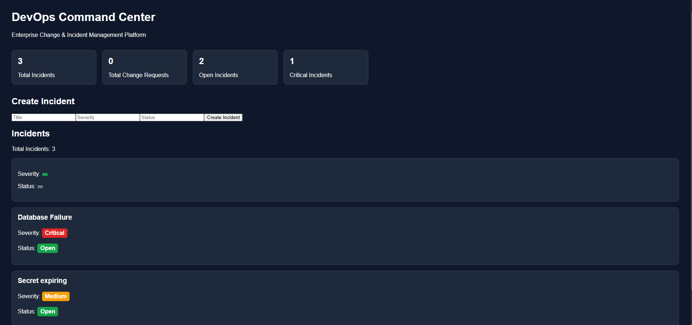
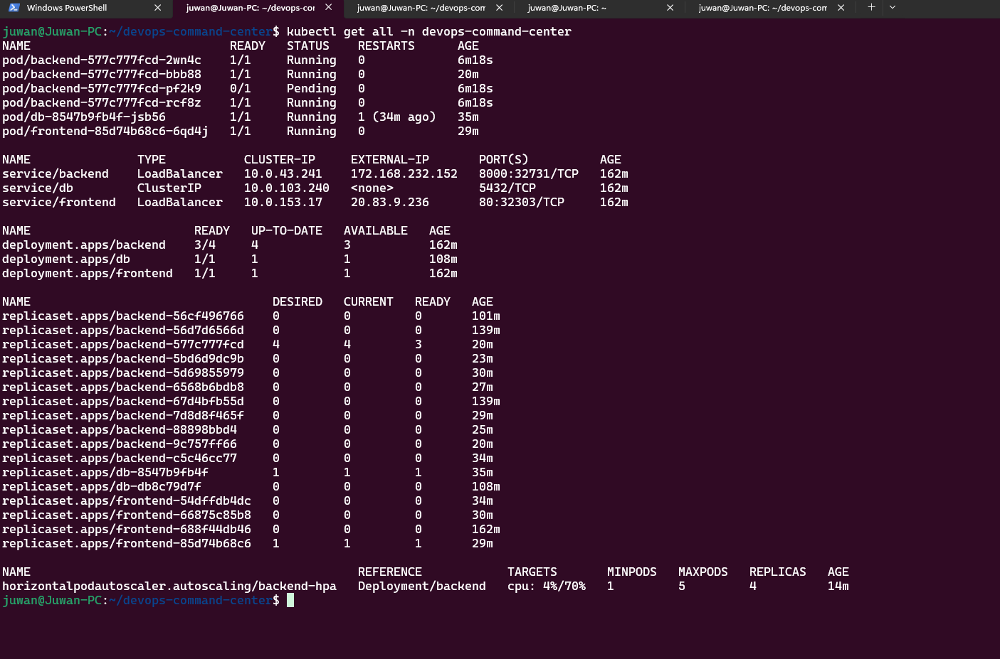
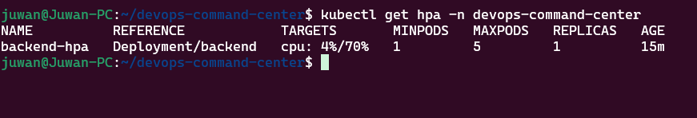
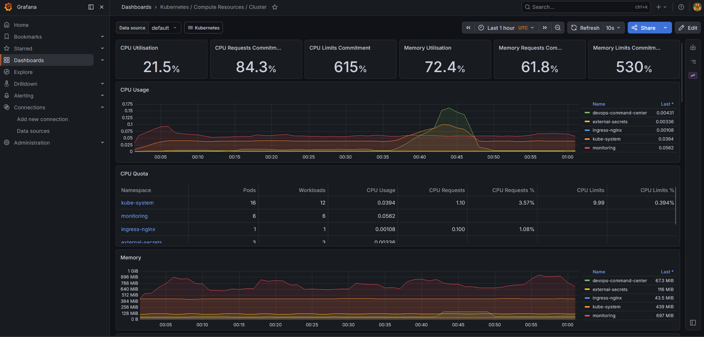
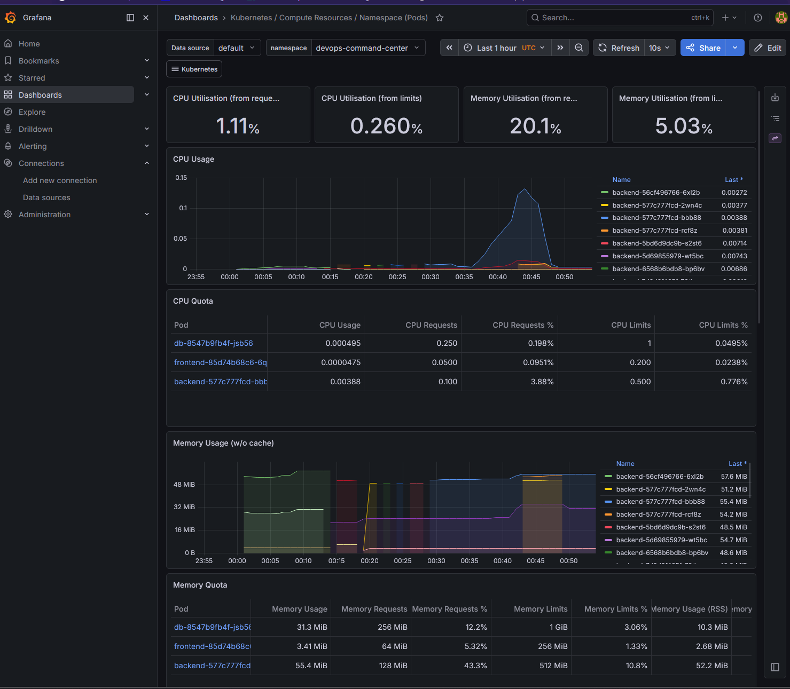
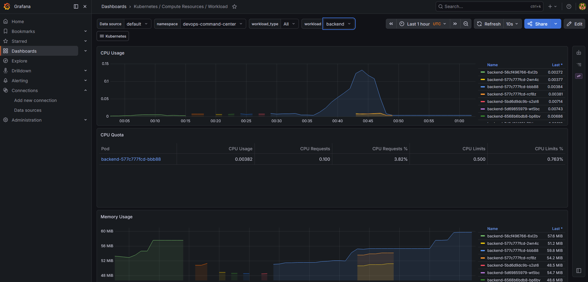
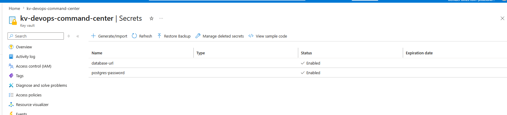
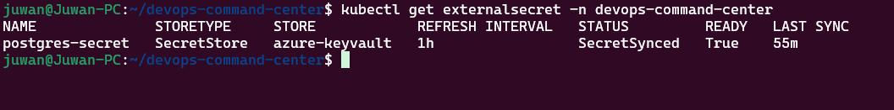

# DevOps Command Center

Enterprise-grade cloud-native platform deployed on Azure Kubernetes Service (AKS) demonstrating modern DevOps practices including CI/CD automation, Kubernetes operations, secrets management, observability, persistent storage, and autoscaling.

---

## Project Overview

DevOps Command Center is a full-stack platform designed to simulate real-world IT operations workflows.

The application provides:

* Incident Management
* Change Request Tracking
* RESTful API Services
* Kubernetes-Based Deployments
* Automated CI/CD Pipelines
* Secure Secret Management
* Monitoring & Observability
* Horizontal Pod Autoscaling

The platform was built to demonstrate practical DevOps and Platform Engineering skills commonly required in enterprise environments.

---

# Executive Architecture

---

# Kubernetes Architecture

---

# Security & Secrets Architecture

---

# Application Flow

The platform follows a modern cloud-native architecture pattern.

1. Developers commit code to GitHub.
2. GitHub Actions builds and validates application code.
3. Docker images are pushed to Azure Container Registry (ACR).
4. Kubernetes deployments pull container images from ACR.
5. Traffic enters the cluster through NGINX Ingress Controller.
6. Requests are routed to frontend and backend services.
7. FastAPI communicates with PostgreSQL for data persistence.
8. PostgreSQL stores data on Azure Managed Disks through Persistent Volume Claims.
9. Azure Key Vault stores sensitive secrets.
10. External Secrets Operator synchronizes secrets into Kubernetes.
11. Prometheus collects metrics across the cluster.
12. Grafana visualizes infrastructure and application health.
13. Horizontal Pod Autoscaler automatically scales workloads based on CPU utilization.

---

# Application Screenshots

## Dashboard

---

# Kubernetes Operations

## Kubernetes Resources

## Horizontal Pod Autoscaler

## Persistent Storage

---

# Observability & Monitoring

## Grafana Cluster Monitoring

## Namespace Metrics

## Autoscaling Metrics

---

# Secrets Management

## Azure Key Vault

## External Secrets Operator

---

# CI/CD Pipeline

The application is automatically deployed through GitHub Actions.

Pipeline stages include:

* Source Control Integration
* Docker Image Build
* Container Registry Push
* Kubernetes Deployment Updates
* Rolling Updates
* Health Validation

### CI/CD Workflow

GitHub → GitHub Actions → Azure Container Registry → Azure Kubernetes Service

---

# Technology Stack

| Layer                  | Technology                     |
| ---------------------- | ------------------------------ |
| Frontend               | React                          |
| Backend                | FastAPI                        |
| Database               | PostgreSQL                     |
| Containerization       | Docker                         |
| Orchestration          | Kubernetes                     |
| Cloud Platform         | Microsoft Azure                |
| Kubernetes Platform    | Azure Kubernetes Service (AKS) |
| Container Registry     | Azure Container Registry (ACR) |
| Secrets Management     | Azure Key Vault                |
| Secret Synchronization | External Secrets Operator      |
| Authentication         | Azure Workload Identity        |
| Storage                | Azure Managed Disk             |
| Monitoring             | Prometheus                     |
| Visualization          | Grafana                        |
| CI/CD                  | GitHub Actions                 |
| Ingress                | NGINX Ingress Controller       |

---

# Kubernetes Features Implemented

### Deployments

* Frontend Deployment
* Backend Deployment
* PostgreSQL Deployment

### Services

* ClusterIP Services
* Service Discovery

### Networking

* NGINX Ingress Controller
* Internal Service Routing

### Reliability

* Liveness Probes
* Readiness Probes
* Rolling Updates

### Resource Governance

* CPU Requests
* CPU Limits
* Memory Requests
* Memory Limits

### Autoscaling

* Horizontal Pod Autoscaler
* CPU-Based Scaling Policies

### Storage

* Persistent Volume Claims
* Azure Managed Disks

---

# Security Features

### Azure Key Vault Integration

Application secrets are stored securely in Azure Key Vault rather than hardcoded into Kubernetes manifests.

### Workload Identity

AKS workloads authenticate to Azure services without storing credentials inside the cluster.

### External Secrets Operator

Secrets are automatically synchronized from Azure Key Vault into Kubernetes Secrets.

### Managed Identity Authentication

Authentication is performed using Azure Managed Identities rather than service principal credentials.

---

# Monitoring Stack

The monitoring solution includes:

* Prometheus Metrics Collection
* Grafana Dashboards
* Kubernetes Metrics Server
* Pod Metrics
* Node Metrics
* Resource Consumption Tracking
* Autoscaling Visibility

---

# Key Accomplishments

✅ Built and deployed a full-stack cloud-native application on AKS

✅ Implemented automated CI/CD pipelines using GitHub Actions

✅ Integrated Azure Container Registry for image management

✅ Configured NGINX Ingress Controller for application routing

✅ Implemented PostgreSQL persistent storage using Azure Managed Disks

✅ Configured liveness and readiness probes for application health monitoring

✅ Implemented CPU and memory resource governance

✅ Built Horizontal Pod Autoscaler for automatic workload scaling

✅ Integrated Azure Key Vault using Workload Identity

✅ Deployed External Secrets Operator for secure secret synchronization

✅ Implemented Prometheus and Grafana monitoring stack

✅ Created production-style observability dashboards

---

# Lessons Learned

This project provided hands-on experience with:

* Kubernetes troubleshooting
* Stateful application deployments
* Persistent storage management
* Azure identity and access management
* Secrets management patterns
* Observability best practices
* Kubernetes autoscaling
* Production deployment workflows
* Cloud-native application operations

---

# Future Enhancements

### Infrastructure as Code

* Terraform-managed AKS
* Terraform-managed Azure Key Vault
* Terraform-managed Monitoring Stack

### Kubernetes

* Helm Chart Packaging
* ArgoCD GitOps Deployments
* Multi-Environment Deployments

### Security

* Azure Entra ID Authentication
* RBAC Enhancements
* Audit Logging

### Observability

* Alertmanager Integration
* Slack Notifications
* OpenTelemetry Tracing

### Application

* User Authentication
* Role-Based Access Control
* Incident Analytics Dashboard
* Advanced Reporting

---

# Author

Built as part of a hands-on DevOps and Platform Engineering portfolio focused on Azure, Kubernetes, CI/CD, Security, Observability, and Cloud-Native Operations.
